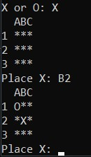
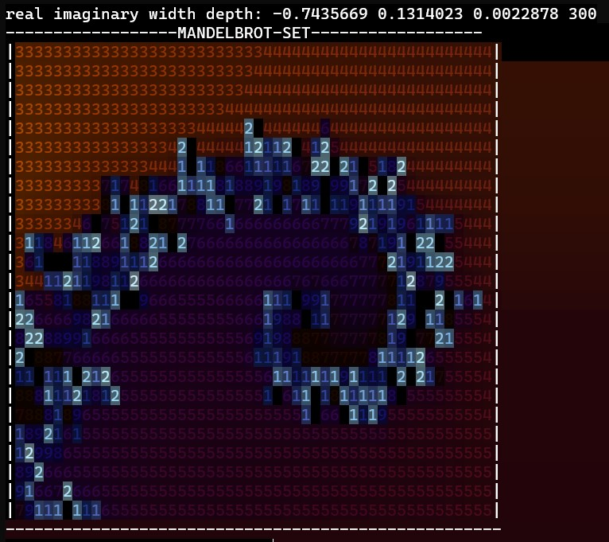

# one-liners

A collection of Python one-line codes.

# One Liners

## Tic Tac Toe
A tic tac toe emulator (with a somewhat functioning minmax!).
 
 

## Mandelbrot Set Viewer
Displays the mandelbrot set with interpolation and a custom gradient.

## Pendulum Calculator
Displays a pendulum graphic (using Euler's method) and plots a graph of the data.
